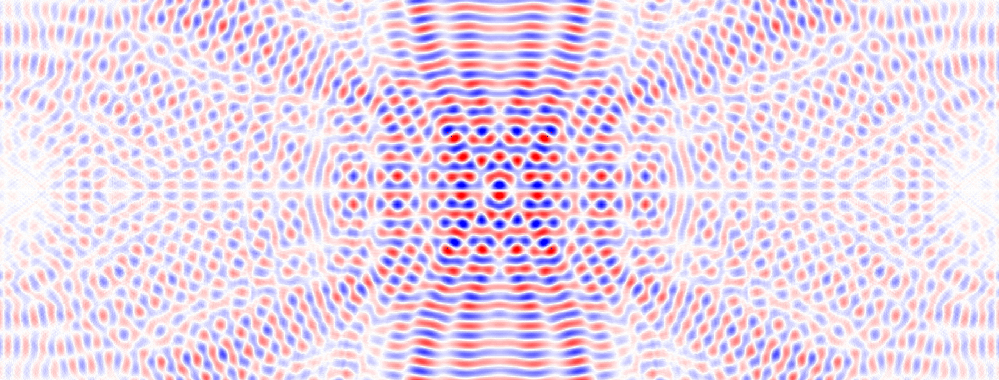

# This project is still under heavy development

# prop

FDTD solver of Maxwell's equations with the use of different backends including GPU.
While computational part is written in c++ you are encouraged to use `python` wrapper to execute calculations and handle
data.

# Build

`prop` uses `cmake` for compilation and relies on CPM to fetch external packages.
Example command to build prop with openmp support, to compile with CUDA support, use `prop-cuda-debug` preset.

``` sh
cmake --preset=prop-openmp-debug
cmake --build build --target pyprop
```
IMPORTANT: please specify `target` when building `prop` otherwise compilation time will be extremely large.
Include target `prop_test` if you want to run unit tests.

You can see all available presets via `cmake --list-presets` command.

# Usage and Examples

You can find examples in `examples` folder. `prop` provides cmake target `copy_python_files_in_binary_dir` to run examples without installation of python package system wide.

``` sh
cd build
cmake --build . --target copy_python_files_in_binary_dir
python ./simple.py

```


## known issues
https://github.com/pybind/pybind11/issues/4606


https://github.com/kokkos/pykokkos-base/issues/55


https://github.com/NVIDIA/thrust/issues/1703


https://forums.developer.nvidia.com/t/strange-errors-after-system-gcc-upgraded-to-13-1-1/252441]


https://github.com/llvm/llvm-project/issues/57544
